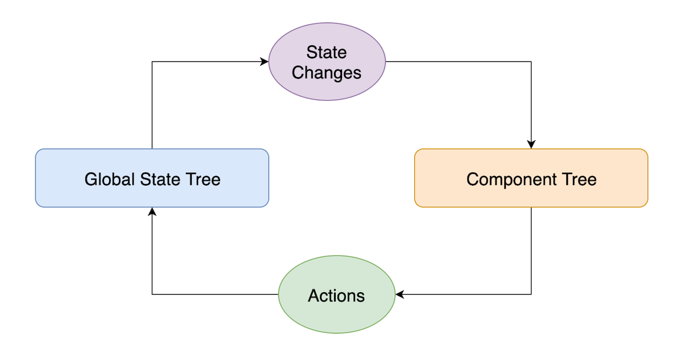

# Chapter 4: Context

---

## Prop Drilling

Notes: Often times data needs to be in multiple components at once. As an example, think of a users username being displayed in both the navigation bar and the profile page at the same time. Using Reacts local state, we would need to hold the state at the parent component of both the navbar and the profile page so that we can pass the username down to both children. This can often lead to passing props down multiple components, which we call "Prop Drilling".

While applications are small, prop drilling is not necessarily a bad thing. However, it can lead to unwieldy code that can be hard to maintain and difficult to refactor as an application grows.

---

## Context to the Rescue

Notes: Context lets you pass data and actions throughout your component tree without manually having to pass as props at every level.

This makes it easier to share a unified state and actions with many components that may not be direct descendants.

Prior to React’s new Context APIs many apps used Redux for centralized state management.

---

## History of Flux



Notes: When React was first released, there were no state management systems available. The React team recommended a pattern they called "Flux", which was just a fancy term for event emitters. The way flux works is - you have a global state outside of your component tree. Components use that state in a read only way, much like props. The state is updated by "Actions", a component can fire an action, and then it's up to the flux state tree to handle that action an emit an event once it's completed.

Redux (and many other libraries) took that initial seed of an idea and expanded on it to form more opinionated state management libraries.

Why is this important to context? This context API is a result of condensing the most commonly used cases across state management librarires into a simple to use API. It's light weight and flexible with very minimal opinions. It's similar to Redux in some ways and very different in it's lack of boilerplate and rigid structure. These days, a lot of our projects end up relying solely on context instead of redux or another state management library.

---

## React.createContext

- Provider
- Consumer

Notes: React exposes the `createContext` api. React.createContext returns a context object with two important properties. Provider and Consumer. The context provider tells our app which properties and current values for those properties to pass down the component tree. Once we set up a provider somewhere in the component tree, any descendant component can use the context Consumer to access the context state. We'll take a look at these in depth now.

---

## Creating Context

```javascript
import React from “react”;

const AnimalContext = React.createContext({
  name: “Milo”
});
```

Notes: Here we create an AnimalContext with the default state of { name: Milo }.

---

## Context Provider

```javascript
const AnimalContext = React.createContext({
  name: “Milo”
});

class WrappedApp extends React.Component {
  state = { name: “Milo” };

  handleChangeName = name => this.setState({ name });

  render() {
    return (
      <AnimalContext.Provider
        value={{
          name: this.state.name,
          changeName: this.handleChangeName
        }}
      >
        <App />
      </AnimalContext.Provider>
    );
  }
}
```

Notes: Provider Components wrap your App’s component subtree. Out of the box, Provider state is driven from a prop called value. We pass anything to value and most commonly it's passed an object of some state. Additionally, we can provide methods that can be used to update context state. Similar to Flux, these methods are frequently called actions. A stateful component wrapping a provider like this is a very common pattern for encapsulating context state.

---

## Context Consumer

```javascript
import { AnimalContext } from “./contexts”;

const DogCard = () => {
  return (
    <AnimalContext.Consumer>
      {({ name }) => (<h1>{ name }</h1>)};
    </AnimalContext.Consumer>
  );
}
```

Notes: Consumer Components can be placed anywhere your App’s tree below the Provider. They let you use any state or actions you’ve provided as a value. One important piece about context is you need to use the same context instance for Provider and Consumer. Here we've structured the app so we import the AnimalContext from the contexts directory. Here we're using the render prop pattern and defining a component inline. Context Consumers can handle any React components as children but you'll want to make sure the props of those children line up with the value that context is providing. Using a render prop like this makes it clear we're grabbing the value for "name" from context and passing it to an H1.

---

```javascript
const DogCard = () => {
  return (
    <AnimalContext.Consumer>
      {({ changeName }) => (
        <button onClick={() => changeName(“Beau”)}>
          Change Name
        </button>
      });
    </AnimalContext.Consumer>
  );
}
```

Notes: We can also execute functions supplied by the Context Provider. In this case, we're updating the `name` value with `"Beau"`. Typically, changeName is called an action. That is, wire firing some action to be taken on the data store. It's up to the data store to handle that action, in this case our Animal Context Provider. We can have any number of Consumers in our app which is why context is useful. We can pass around state and actions to any number of components anywhere in the tree.

---

## All Together

```javascript
const initialState = { name: “Milo” };

const AnimalContext = React.createContext(initialState);

class WrappedApp extends React.Component {
  state = initialState;

  handleChangeName = name => this.setState({ name });

  render() {
    return (
      <AnimalContext.Provider
        value={{
          name: this.state.name,
          changeName: this.handleChangeName
        }}
      >
        <App />
      </AnimalContext.Provider>
    );
  }
}

const DogCard = () => {
  return (
    <AnimalContext.Consumer>
      {({ name, changeName }) => (
        <h3>{name}</h3>
        <button onClick={() => changeName(“Beau”)}>
          Change Name
        </button>
      });
    </AnimalContext.Consumer>
  );
}
```

Notes: The context API is very lightweight and flexible. In this simple case we're passing down state as "name" and an action to change that name. In our WrappedApp component we're storing that state and updating the "value" of context when it changes. Which in turn will re-render our consumers.

---

## Sample Context

```javascript

const AuthContext = React.createContext({});

export class AuthProvider extends React.Component
  state = {
    isLoggedIn: false,
  }

  updateLoginState = (isLoggedIn) => {
    this.setState({ isLoggedIn });
  }


  render() {
    return (
      <AuthContext.Provider
        value={{
          isLoggedIn: this.state.isLoggedIn,
          updateLoginState: this.updateLoginState
        }}
      >
        {this.props.children}
      </AuthContext.Provider>
    );
  }
};

export const AuthConsumer = AuthContext.Consumer;

```

Notes: A common pattern is to wrap the base Provider in a stateful component and expose the context Provider and Consumer from the same file. Here we define an auth context with state isLoggedIn and an action for updating logged in state. The provider then renders children normally. In this way we can encapsulate state in this provider component and expose it to any components that use this AuthConsumer. We're still calling our component here a provider because it performs the same job as React's base Provider plus some added state management.

---

## Using the custom context

```javascript
// In index.js
<AuthProvider>
  <App />
</AuthProvider>;

// In a consuming component
const Login = () => {
  return (
    <AuthConsumer>
      {({ isLoggedIn, updateLoginState }) => isLoggedIn ?
        <LogoutButton onLogout={() => updateLoginState(false)} /> :
        <LoginForm onLogin={() => updateLoginState(true)} />
      }
    </AuthConsumer>
  )
};
```

Notes: We render our AuthProvider somewhere near the top in the component tree. That way all our components have access to it. In a consuming component called Login, we're destructuring the "value" from context. We use both the isLoggedIn state to drive which component to show. And we also use the updateLoginState action as a prop to our different components. Again, we're using the render prop pattern here for clarity but it's not necessary. Whenever the context provider state changes, in our case from updateLoginState, this component will re-render with the new value.

---

## static contextType

```javascript
import { AppContext } from "../context";

class Inbox extends Component {
  static contextType = AppContext;

  render() {
    const { isAuthenticated, emails } = this.context;

    ...
  }
}
```

Notes: There is another way consume context without using a Consumer component. Class components may set a static property contextType on themselves which tells react to set this.context to the current value of the Provider. This component will update and re-render anytime the context Provider value changes. In practice, it's much simpler to restrict context usage to just Providers and Consumers for consistency. There's nothing stopping us from using a Consumer in this classes render method and it may even improve legibility. It's also important to default to function components where possible and static contextType is only useful for class components.

---

## Exercises

1. Implement a context component that exports a Provider and Consumer.

2. Wrap the App in the newly created AppProvider.

3. Move the polling functionality from the Inbox component to the context
   component.

4. Update the Inbox component to use the new context.

5. Update the NavBar component to use the new context.

6. Update the Preview component to use the new context.
