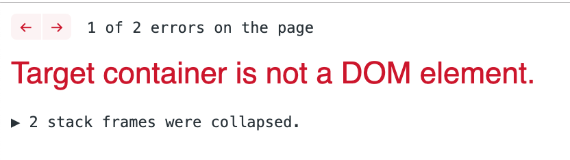
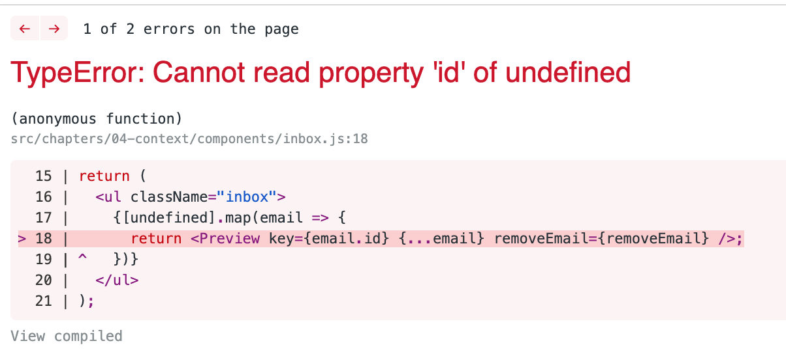
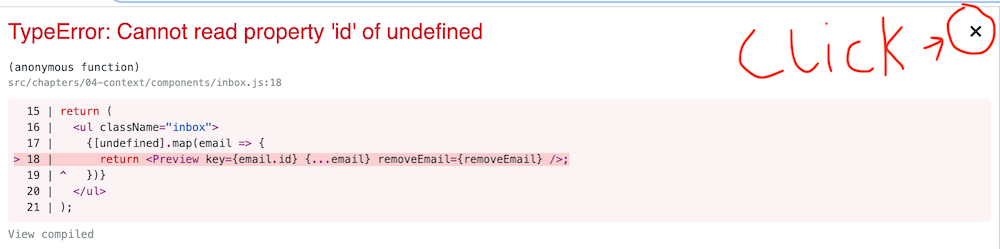

# Portals

---

## What is a Portal?

Notes: React 16 introduced a new concept for complex DOM manipulation. Portals are a way to render any component outside the location of its parent DOM node. Now we have the ability to render any component to any DOM node. This is really powerful and opens up some new possibilities within React. That said, it is easy to abuse portals, so make sure you truly need a portal for your UX before reaching for this tool.

---

## Portal Uses

- Modals
- Dialogs
- Tooltips
- Notifications / Toasts
- Support widgets
- Content extending beyond parent container
- Multi windowed apps???

Notes: The most common use cases of portals are modals and dialog boxes. Previously in React, modals were hard to build without breaking out of the React declarative paradigm. Now we can render a modal from anywhere in the component tree. Other common use cases include tooltips, notifications and toasts, support and chat widgets. Another big win is the ability to break out of a parent node that has overflow set. You can even use portals to drive separate windows from the same React app.

---

## Portal API

```javascript
const Modal = (props) => {
  return ReactDOM.createPortal(
    // Any component will work here
    props.children,
    document.getElementById("modal-root")
  );
}
```

Notes: The portal API is relatively straightforward. ReactDOM.createPortal takes two arguments - the component to render, and the DOM node to render it to. Any component can be rendered to a Portal. A common pattern for modals is to render children so the modal consumer can decide. For other portal use cases you may want to define the structure in the portal component. The second argument is a DOM Node that must exist in the DOM. If the DOM node doesn't exist, you'll get a "Target container is not a DOM element." error.

---



Notes: There are a couple ways to avoid this. Most apps have an index.html where you can place portal ids. That's how we've structured our example app. In other cases, you may want a parent or ancestor component to render a specific div. Sometimes the top level app component is used to render portal destinations.

---

```javascript
const Modal = (props) => {
  return ReactDOM.createPortal(
    props.children,
    document.getElementById("modal-root")
  );
}

class ShowModalButton extends React.Component {
  render() {
    <>
      <button onClick={() => this.setState({ showModal: true })}>
        Show Modal
      </button>

      {this.state.showModal && (
        <Modal>
          <h2>You clicked the button!</h2>
          <button onClick={() => this.setState({ showModal: false })}>
            Close
          </button>
        </Modal>
      )}
    </>
  }
}
```

Notes: We can drive the modal display from this parent component even though it's rendering to a different DOM node. An important aspect of portals is that their content behaves just like any other React component. Here we have an onClick handler in a button that's rendered in a totally different part of the DOM. Yet to our React components, the onClick handler is the same as any other. Events in portal content are handled just like any other component.

---

## Portal tips

- Handle keyboard focus and accessibility
- Use separate, identifiable DOM elements
- Allow dismissal
- Available in both functional and class components

Notes: With portals, you need to be careful to handle keyboard navigation, focus management, and ARIA attributes especially for modals and dialogs. Accessibility with portals requires a little extra effort. For DOM elements, make sure your portal is using a DOM element reserved for that portal. Portals can get messy if you reuse a DOM node for multiple different portals. Dismissal is more of a UX pattern but it does have ramifications in code. You'll need to code for the different ways a modal, dialog, or notification can be dismissed.

---


---

# Error Boundaries

---



Notes: This is a very common error in React. We tried to access a property on an undefined variable that we thought was an object. There are a few ways to prevent this. We could add a null check to make sure our variable is the object we expect. We could use TypeScript so we catch most of these cases at compile time. But sometimes these errors are unavoidable. For example, say you work within a company where a marketing team can inject a banner ad into your React app. This banner ad may or may not be written defensively so it's up to your code to have a graceful fallback. This is why React 16 introduced error boundaries.

---

## Error Boundaries

- Will allow for graceful fallback
- Will Prevent full app crashes
- Won't prevent render errors
- Will only catch render errors

Notes: Error boundaries do not prevent the errors from surfacing, they just allow you to catch rendering errors. In practice, this means you can show the user an alternative when a component throws during render. This is a very powerful tool for situations where you know the component render is dangerous. You can also prevent full app crashes by placing a top level error boundary to catch unforseen errors and render an error page, like you would for a 500 or 404 server error. The important thing to note here is that error boundaries only catch rendering errors.

---

## Not Caught by Error Boundaries

- setTimeout or setInterval errors
- Request errors
- Event handler errors
- Server Side Rendering
- Errors from parents/ancestor components
- Any error outside of the render loop

Notes: There are many errors that won't be caught by error boundaries. Asynchronous errors in timeouts, intervals, or elsewhere. Any AJAX or request or fetch errors. Event handler errors will also go uncaught in error boundaries. Any error not specifically caused by the render functions in the tree below the error boundary will have to be handled separately. You should always be coding those other situations defensively and there are many best practice tutorials online for timers, async, and event handlers. Today we'll focus on rendering errors and the new error boundary API.

---

## Error Boundary API

- componentDidCatch()
- static getDerivedStateFromError()

Notes: As of right now, there is no way to use error boundaries in functional components. These two methods must be added to a class component.

---

## componentDidCatch

```javascript
class ErrorWrapper extends React.Component {
  componentDidCatch(error, errorInfo) {
    // error is the specific error thrown
    // errorInfo is an object with the property "componentStack"

    logError(error, errorInfo.componentStack);
  }
}
```

Notes: componentDidCatch is where you handle side effects from errors. Things like logging, or firing off requests based on the error should happen here. This method is called with two arguments, the specific error thrown and an object containing a property componentStack. componentStack is Reacts version of a stack trace down the component rendering tree. Again, this method is mainly for side effects. You can call this.setState inside of componentDidCatch but it's preferable to use the other method getDerivedStateFromError.

---

## static getDerivedStateFromError

```javascript
class ErrorWrapper extends React.Component {
  static getDerivedStateFromError(error) {
    // error is the specific error thrown

    // The returned state object will be merged with current state
    return { renderingError: true };
  }

  render() {
    if (this.state.renderingError) {
      return <ErrorMessage>Something is Broken</ErroMessage>;
    }

    return this.props.children;
  }
}
```

Notes: getDerivedStateFromError is a static method on a class component that lets us return an updated state. This method should be side effect free since it's only purpose is for us to shape state. Then we can use that new state to render a different, error-free component. In this case, if we have an error, we return an ErrorMessage component with the message "Something is Broken". Otherwise we return this.props.children.

---

>As of React 16, errors that were not caught by any error boundary will result in unmounting of the whole React component tree.

Notes: With the addition of error boundaries, React has made some adjustments to the way rendering errors are handled. The rationale here is that it's better to handle the error with an error boundary than for React to try to render broken UI. In practice, this means all apps should have at least a top level error boundary and potentially others for graceful degradation.

---



Notes: In development mode AKA when not running in production, React will surface all errors into a full screen modal like this. This modal is completely benign and doesn't affect the underlying app state. It can be dismissed by clicking the x in the top right corner. Since our exercise repo is running in dev mode, you'll have to click the x when completing the error boundary exercises.


## Exercises

1. Create a Modal component using ReactDOM.createPortal in components/modal.js

2. Create a class component in components/email-error.js with error boundary methods

3. Wrap the Preview component in components/inbox.js with the error boundary

